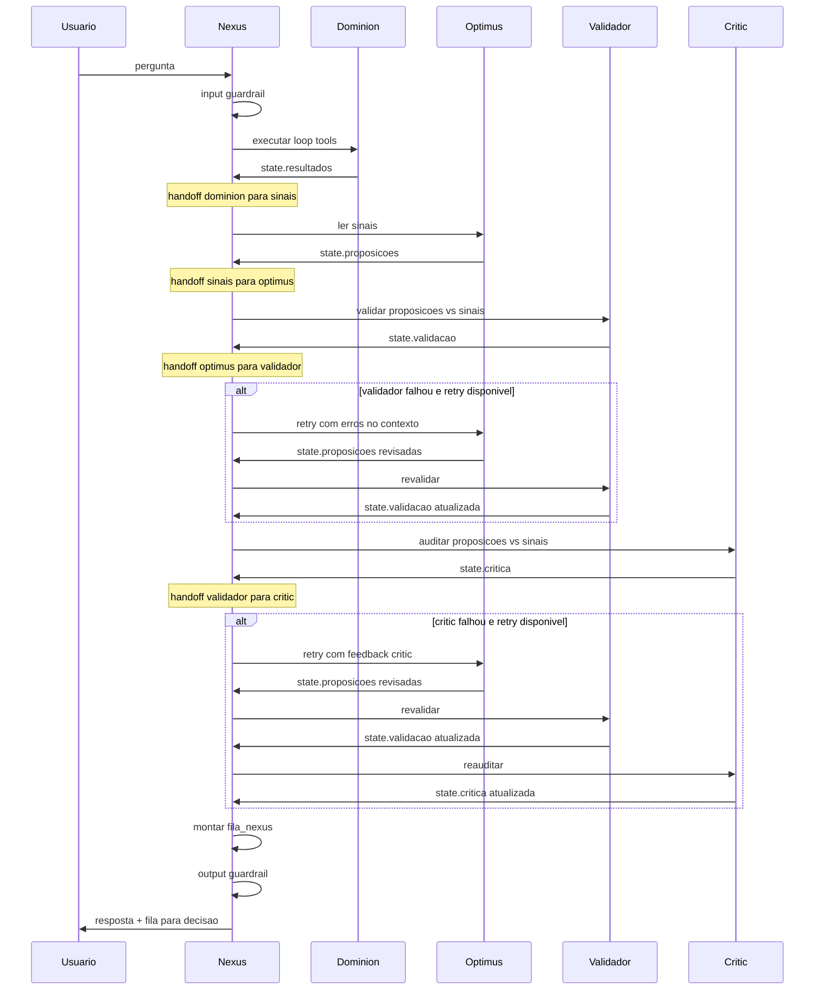
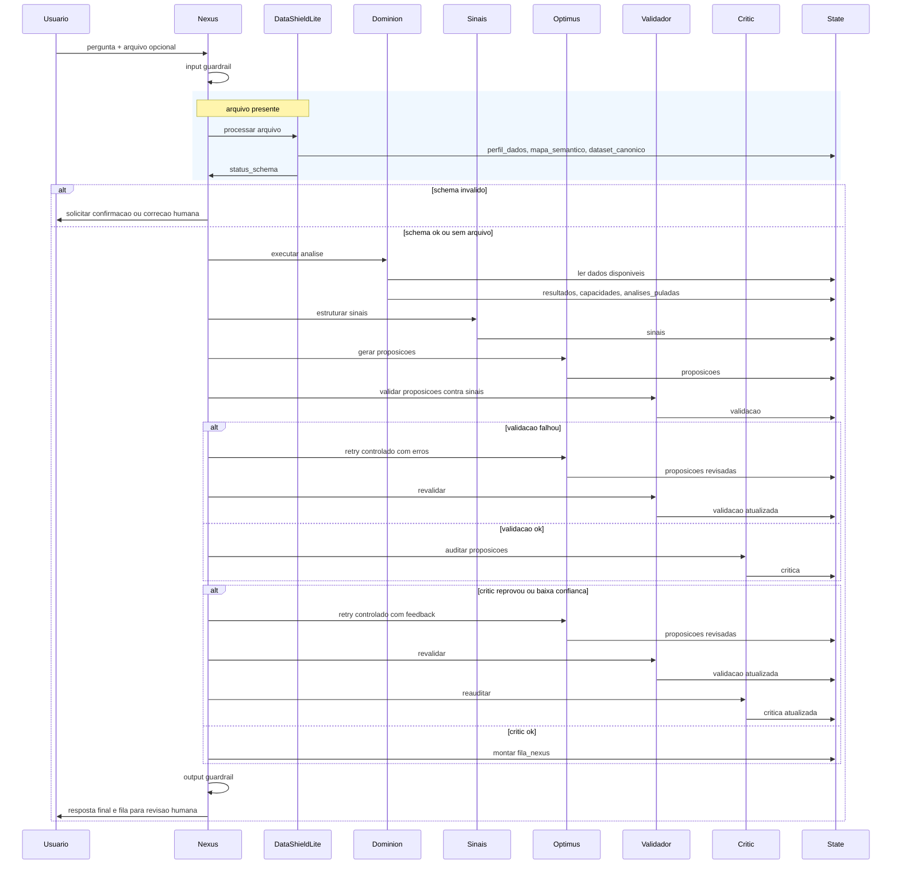
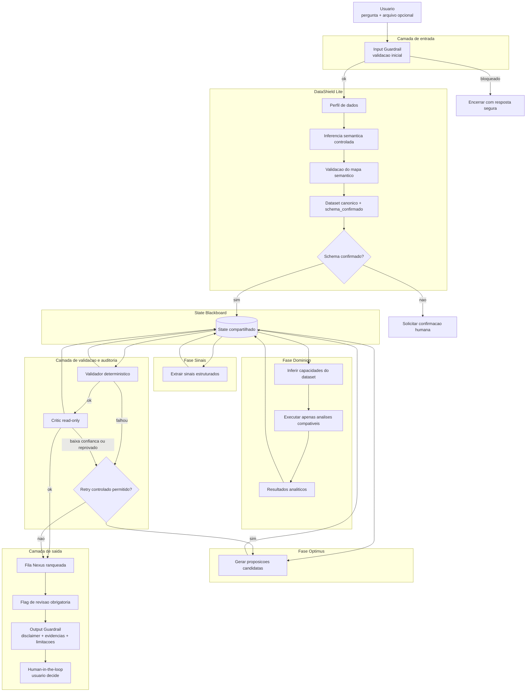

# Sense to Respond - MVP Nexus

Sistema multi-agente para deteccao de sinais e geracao de proposicoes de acao
na cadeia comercial (S&OE), com harness controlado e human-in-the-loop.

Principio central: **IA = LLM + Harness**. Numeros sao sempre calculados por
tools deterministicas (Python/pandas). O LLM decide passos e gera narrativa.

## Pre-requisitos

- Python 3.10+
- Chave da API OpenAI

## Instalacao

```bash
git clone https://github.com/romulobsilva/sense-to-respond.git
cd sense-to-respond

python -m venv .venv
source .venv/bin/activate

pip install -r requirements.txt

cp .env.example .env
# Edite .env e defina OPENAI_API_KEY
```

## Configuracao (.env)

| Variavel | Padrao | Descricao |
|---|---|---|
| `OPENAI_API_KEY` | - | Chave da API OpenAI (obrigatoria) |
| `OPENAI_MODEL` | `gpt-4o-mini` | Modelo LLM |
| `LIMIAR_CONFIANCA_CRITIC` | `0.7` | Abaixo disso: revisao obrigatoria |
| `MAX_OPTIMUS_RETRIES` | `1` | Retries do Optimus (0 a 3) |

## Execucao

Modo MVP completo (Nexus + Validador + Critic + fila):

```bash
python main.py --modo nexus
```

Modo legado (apenas Dominion + explicacao):

```bash
python main.py --modo legado
```

Chat analitico Power BI (ADR-0026; paralelo ao batch; nao gera PDF):

```bash
# one-shot (requer PBI_ACCESS_TOKEN + PBI_ARTIFACT_ID; modelo default gpt-5.4)
python main.py --modo chat --pergunta "Tem estoque suficiente no curto prazo?"

# REPL sequencial (historico em RAM ate "sair"; estilo Cursor/ChatGPT)
python main.py --modo chat
```

Salvar auditoria em arquivo customizado:

```bash
python main.py --modo nexus --audit-out auditoria/minha_sessao.json
```

## Testes

```bash
python -m pytest tests/ -v --override-ini="addopts="
```

## Arquitetura (MVP)

Componentes principais:

| Componente | Arquivo | Usa LLM? | Papel |
|---|---|---|---|
| **Nexus** | `nexus.py` | Nao | Orquestra a sequencia e governa o fluxo |
| **Dominion** | `harness.py` | Sim | LLM escolhe a ordem das tools; Python calcula |
| **Optimus** | `optimus.py` | Nao | Transforma sinais em propostas (deterministico) |
| **Validador** | `validator.py` | Nao | Checa regras formais (sim/nao) |
| **Critic** | `critic.py` | Sim | Julga coerencia (LLM leitura-only) |
| **Chat PBI** | `chat_pbi.py` | Sim | Q&A analitico MCP (ADR-0026; paralelo ao batch) |
| **Guardrails** | `guardrails.py` | Nao | Input/output guardrails |
| **State** | `state_types.py` | Nao | Blackboard compartilhado entre agentes |

### Fluxo de eventos e handoffs (MVP implementado)

O diagrama abaixo mostra o pipeline implementado no MVP. Cada seta e uma
chamada real no codigo. Os blocos `Note` marcam handoffs (transicoes de fase
registradas na auditoria). Os blocos `alt` representam retries controlados
pelo Nexus quando o Validador ou o Critic encontram problemas.



**Principios do fluxo:**

- **Nenhum componente se autoaprova.** Optimus propoe, Validador contesta regras formais, Critic contesta coerencia, Nexus arbitra, humano decide.
- **Handoff** = passagem formal de artefato via state, registrada na auditoria para rastreabilidade.
- **Retry controlado:** se Validador ou Critic falhar, Nexus envia os erros como feedback ao Optimus, que regenera propostas. Limite configuravel via `MAX_OPTIMUS_RETRIES`.
- **LLM nunca calcula numeros.** Todos os impactos financeiros e desvios sao calculados por Python/pandas.

### Visao macro com DataShield (MVP + fase futura)

O diagrama abaixo inclui o DataShield Lite (fase 1.5, planejado) que fara
inferencia semantica de arquivos xlsx/csv antes do Dominion. O restante do
pipeline e o mesmo do MVP.



### Pipeline detalhado (flowchart)

Visao por camadas: entrada, DataShield, state blackboard, Dominion, Sinais,
Optimus, validacao/auditoria e saida com human-in-the-loop.



**Guardrails (3 camadas):**

| Camada | Quando roda | O que faz |
|---|---|---|
| **Input** | Antes de qualquer LLM/tool | Bloqueia pergunta curta, longa ou com injection |
| **Harness** | Durante execucao | Whitelist de tools, max iteracoes, JSON validado com retry |
| **Output** | Antes de devolver ao usuario | Disclaimer obrigatorio, citacoes, flag de revisao |

## Documentacao

- `docs/architecture.md` - especificacao da solucao
- `docs/planning.md` - checklist de implementacao
- `docs/testing.md` - guia de testes
- `docs/adr/` - decisoes arquiteturais (ADRs)
- `rules.md` - regras de desenvolvimento

Documentos de contexto EY/7D (PDF, PPTX) **nao estao versionados** neste
repositorio por serem material interno.

## Licenca

A definir.
